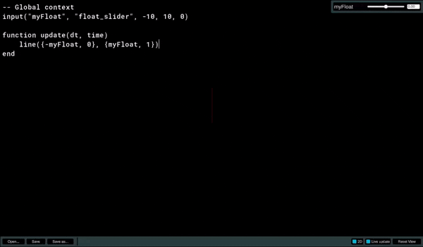

# About
Unity-based 3D playground for testing/prototyping math/geometry algorithms.  
The project is a WIP.  

# Features
- 3D scene with a mouse/keyboard controllable camera
- LUA scripting for sandboxing stuff
- A few (yet) functions for rendering lines, vectors, triangles with color support
- User defined inputs to control code parameters during runtime (Only float slider is supported for now)

# TODO
- Add more primitives (spheres, cubes, etc.)
- Add more functions for rendering (text, etc.)
- Open/Save LUA scripts feature
- Add more input types (int, bool, etc.)
- Live code reloading
- Forward Unity functions to LUA (e.g. raycasting, etc.)
- Add examples
- Add documentation

# Usage
## Keyboard shortcuts
- `~`: Toggle LUA script editor
- `F5`: Execute current LUA script
- `RMB` (hold): Enter camera control mode
- `WASDQE`: Move camera in WASD-space + QE for up/down

## LUA scripting
Global context is available for initialization logic (for example, to define inputs).  
`function update(dt, time)` is called every frame, dt - delta time, time - time since start.  
`Vector3` is bound to LUA table. Pass `{x, y, [z = 0]}` to functions that accept Vector3. Z component is optional (0 by default).  
`Color` is bound to LUA table and should be used as `{r, g, b, [a = 1]}`. Alpha component is optional (1 by default).

Available functions:  
- `color(Color color)` - setup color in 0.0-255.0 range for the next primitives. Call before each primitive to control their color separately or define a global color once in global section.  
- `color_norm(Color color)` - the same as `color` but accepts color in normalized 0.0-1.0 range.  
- `line(Vector3 p1, Vector3 p2)` - render a line from p1 to p2.  
- `vector(Vector3 origin, Vector3 scaledDirection)` - render a vector from origin with direction (and magnitude).  
- `tri(Vector3 p1, Vector3 p2, Vector3 p3, [bool filled = false])` - render a triangle from p1 to p2 to p3.  
- `input(string paramName, string paramType, [... args])` - define an input parameter. See inputs section for more info.  
- `print(object message)` - print a message to the console. Any printable LUA entity is allowed.  

### Inputs
Inputs are defined in global context. Defining input in `update` function will result in an error.  
Supported input types:
- `float_slider`, args `(..., [float minValue = 0], [float maxValue = 1], [float defaultValue = 0])` - float slider with min/max boundaries and default value.  


## Example:
```lua
input("myFloat", "float_slider", -10, 10, 0)

function update(dt, time)
    line({-myFloat, 0}, {myFloat, 1})
end
```
